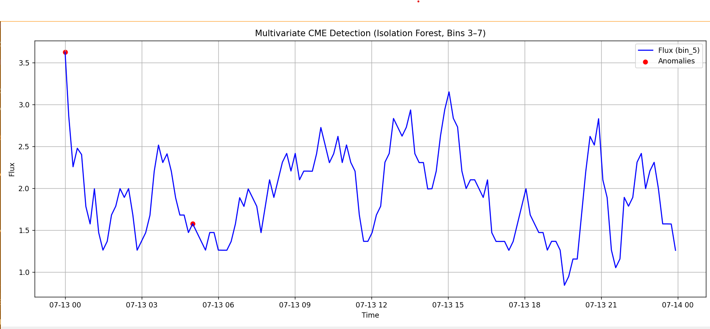

# 🌌 CME Detection using Isolation Forest

Detect **Coronal Mass Ejection (CME)** events from solar observation CDF files using **unsupervised anomaly detection**.  
This project leverages **Aditya-L1's ASPEX-SWIS** dataset and machine learning to automatically flag unusual proton flux patterns in specific energy bins.

---

## 📖 Overview
Coronal Mass Ejections are massive bursts of plasma and magnetic field from the Sun’s corona.  
They can have major effects on Earth’s **space weather** environment, affecting satellites, power grids, and communication systems.  

**This project:**
- 📂 Loads **CDF files** from ISDA (ISRO Science Data Archive)  
- 🎯 Selects specific **energy bins** from proton flux data  
- 🔄 Smooths the data to reduce noise  
- 🤖 Uses **Isolation Forest** to detect anomalies (possible CME events)  
- 📊 Plots the results with anomalies clearly highlighted  

---

## ⚙️ Installation
Clone the repository and install dependencies:
```bash
git clone https://github.com/yourusername/cme-detection.git
cd cme-detection
pip install -r requirements.txt
```


## 📥 Data
You can download them from ISDA (ISRO Science Data Archive):

Go to https://pradan1.issdc.gov.in/al1/protected/payload.xhtml

Search for the ASPEX-SWIS dataset

Download .cdf files for your desired date range

Place them in the data/ folder

Note: The repository already contains a sample dataset used for training the model.

## Usage
Run the detection script:

bash
Copy
Edit
python src/detection.py data/AL1_AST91_L2_PS_20250713_V01.cdf
The script will:

Load the CDF file

Select energy bins 3–7

Smooth the data (rolling mean)

Detect anomalies using Isolation Forest

Plot Bin 5 flux with anomalies highlighted in red

## Methodology
Data Extraction – Load timestamps and proton flux for selected energy bins

Noise Reduction – Apply rolling mean smoothing

Anomaly Detection – Isolation Forest flags ~1% of points as anomalies

Visualization – Blue line shows flux, red dots mark anomalies

Workflow Diagram:

mathematica
Copy
Edit
CDF File → Extract Epoch & Flux
         → Select Bins (3–7)
         → Smooth Data
         → Isolation Forest
         → Anomaly Timestamps
         → Plot Results
🖼 Example Output
The blue curve shows flux intensity over time for Bin 5.
Red dots indicate timestamps flagged as potential CME events.


## Requirements
Python 3.8+

cdflib

pandas

matplotlib

scikit-learn

Install with:

bash
Copy
Edit
pip install -r requirements.txt

## Author
Dinesh Sathvik – Space Weather Data Science Enthusiast

pgsql
Copy
Edit

